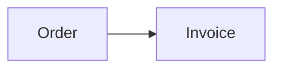
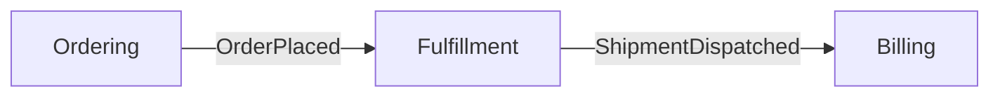

# CONTEXT.md Format

Domain context artifacts live under `ai-artifacts/`.

## Structure

````md
# {Context Name}

{One or two sentences describing what this context is and why it exists.}

## Model



## Language

**Order**:
{A one or two sentence definition of the term.}
_Avoid_: Purchase, transaction

**Invoice**:
A request for payment sent to a customer after delivery.
_Avoid_: Bill, payment request

**Customer**:
A person or organization that places orders.
_Avoid_: Client, buyer, account
````

The `Model` section is optional when a context is genuinely simple. When relationships, boundaries, states, or flows matter, include either an embedded Mermaid diagram or ASCII art. Never create a standalone diagram file.

## Rules

- **Be opinionated.** When multiple words exist for the same concept, pick the canonical term and list alternatives under `_Avoid_`.
- **Keep definitions tight.** Use one or two sentences. Define what a concept is, not its implementation.
- **Include only context-specific terms.** General programming concepts do not belong merely because the project uses them.
- **Group related terms** when natural clusters emerge; otherwise keep one flat language list.
- **Keep diagrams conceptual.** Show domain relationships, states, flows, and boundaries—not classes, frameworks, databases, or deployment topology.
- **Use glossary terms in diagrams.** A diagram must reinforce the ubiquitous language rather than introduce synonyms.

## Single-context repositories

Use one glossary:

```text
ai-artifacts/CONTEXT.md
```

System-wide ADRs live at:

```text
ai-artifacts/docs/adr/
```

## Multiple-context repositories

Use a context map and context-specific glossaries:

```text
ai-artifacts/
├── CONTEXT-MAP.md
├── docs/
│   └── adr/
└── src/
    ├── ordering/
    │   ├── CONTEXT.md
    │   └── docs/adr/
    └── billing/
        ├── CONTEXT.md
        └── docs/adr/
```

`ai-artifacts/src/` mirrors context ownership in the application source tree. It contains project knowledge, not application code.

A context map lists contexts, where their artifacts live, and how they relate:

````md
# Context Map

## Contexts

- [Ordering](./src/ordering/CONTEXT.md) — receives and tracks customer orders
- [Billing](./src/billing/CONTEXT.md) — generates invoices and processes payments
- [Fulfillment](./src/fulfillment/CONTEXT.md) — manages warehouse picking and shipping

## Relationships



- **Ordering → Fulfillment**: Ordering emits `OrderPlaced`; Fulfillment starts picking.
- **Fulfillment → Billing**: Fulfillment emits `ShipmentDispatched`; Billing generates an invoice.
````

## Detecting the structure

- If `ai-artifacts/CONTEXT-MAP.md` exists, read it to locate contexts.
- If only `ai-artifacts/CONTEXT.md` exists, treat the repository as one context.
- If neither exists, create `ai-artifacts/CONTEXT.md` lazily when the first term is resolved.
- When multiple contexts exist, infer the relevant context from the work. Ask only when ownership remains ambiguous after inspecting the codebase.
