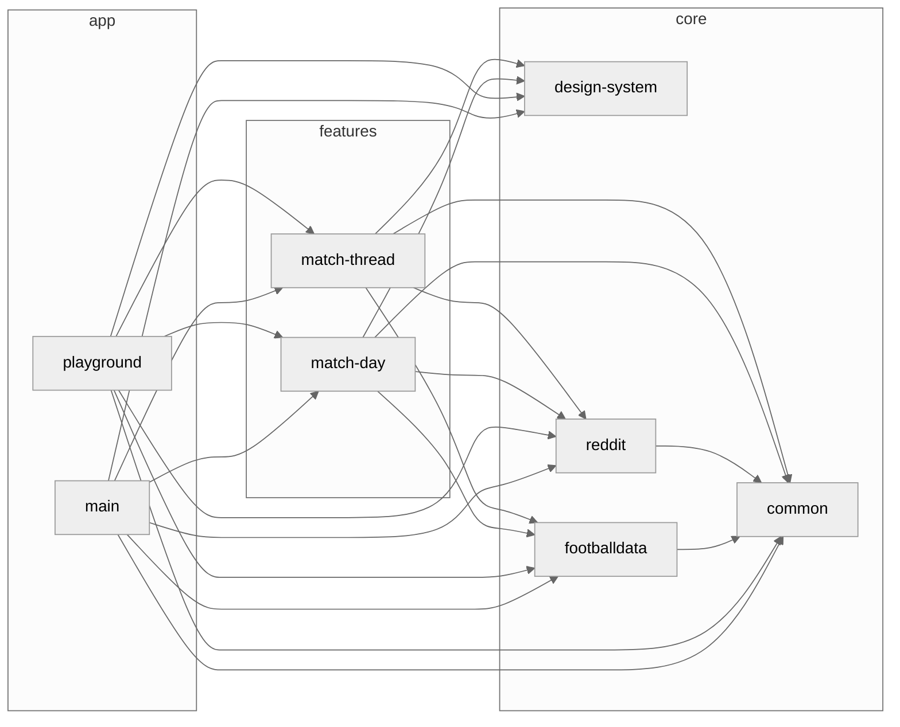

# Gradle Module Dependency Graph Plugin

[](https://github.com/iurysza/module-graph/actions?query=workflow%3A%22Pre+Merge+Checks%22) [](LICENSE) 

Introducing the Gradle Module Dependency Graph Plugin! 🌟

This plugin generates a [Mermaid](https://github.com/mermaid-js/mermaid) dependency graph for your Gradle project.
It provides a visual representation of your project's module dependencies, making it easier to understand the structure and relationships between modules.

>A diagram about the current system is only useful if it's generated. If it is produced by hand it documents the author's belief, not the system. Still, important, but not an input for decision making. Development is primarily decision making. Enable it through custom tools. [source](https://twitter.com/girba/status/1628326848256962561)

## Features

- Generate a Mermaid dependency graph of the modules in your Gradle project
- Automatically append the generated graph to your project's README file

## Getting Started

You'll just need to add it to your project's `build.gradle` or `build.gradle.kts` file.

<details>
  <summary><b>build.gradle (Groovy DSL)</b></summary>

### Using the [plugins DSL](https://docs.gradle.org/current/userguide/plugins.html#sec:plugins_block)

```groovy
plugins {
  id "dev.iurysouza.modulegraph" version "0.1.1"
}
```

### Using [legacy plugin application](https://docs.gradle.org/current/userguide/plugins.html#sec:old_plugin_application)

```groovy
buildscript {
  repositories {
    maven {
      url "https://plugins.gradle.org/m2/"
    }
  }
  dependencies {
    classpath "dev.iurysouza:modulegraph:0.1.1"
  }
}

apply plugin: "dev.iurysouza.modulegraph"
```
### Configuring the plugin
```groovy
  moduleGraphConfig {
      readmePath = '$projectDir/README.md'
      heading = '### Dependency Diagram'
      theme = dev.iurysouza.modulegraph.Theme.NEUTRAL
  }
```
</details>

<p></p>

<details open>
<summary><b>build.gradle.kts (Kotlin DSL)</b></summary>

<p></p>

#### Using the [plugins DSL](https://docs.gradle.org/current/userguide/plugins.html#sec:plugins_block)


```kotlin
plugins {
  id("dev.iurysouza.modulegraph") version "0.1.1"
}
```

#### Using [legacy plugin application](https://docs.gradle.org/current/userguide/plugins.html#sec:old_plugin_application)

```kotlin
buildscript {
  repositories {
    maven {
      url = uri("https://plugins.gradle.org/m2/")
    }
  }
  dependencies {
    classpath("dev.iurysouza:modulegraph:0.1.1")
  }
}

apply(plugin = "dev.iurysouza:modulegraph")
```

### Configuring the plugin

```kotlin
moduleGraphConfig {
    readmePath.set("$projectDir/README.md")
    heading.set("### Dependency Diagram")
    theme.set(dev.iurysouza.modulegraph.Theme.NEUTRAL)
}
```
</details>

## Configuration

To configure the Gradle Module Dependency Graph Plugin, you can set the following options:

- `readmeFile`: The README file where the dependency graph will be appended.
- `theme`: The theme to be used for styling the graph. Default is `NEUTRAL`.
- `heading`: The heading where the dependency graph will be appended.

## Usage

To generate the Mermaid dependency graph for your project, run the following command:

```sh
./gradlew createModuleGraph
```

### Example Diagram

You can expect the plugin to generate this kind of diagram after running the plugin:



## Contributing 🤝

Feel free to open an issue or submit a pull request for any bugs/improvements.

## License 📄

This template is licensed under the MIT License - see the [License](License) file for details.
