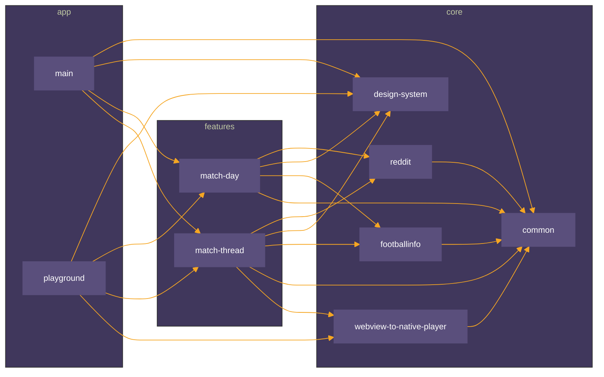
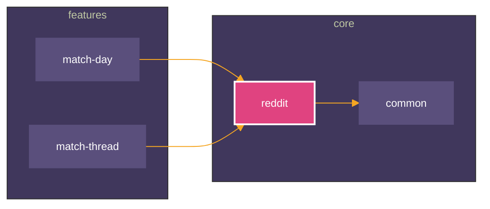
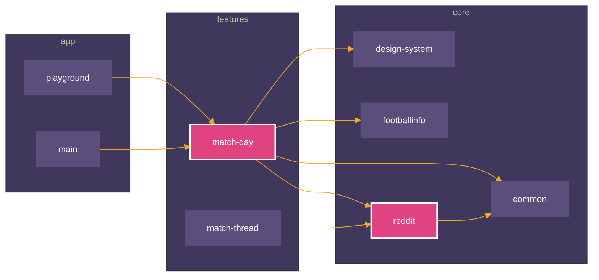
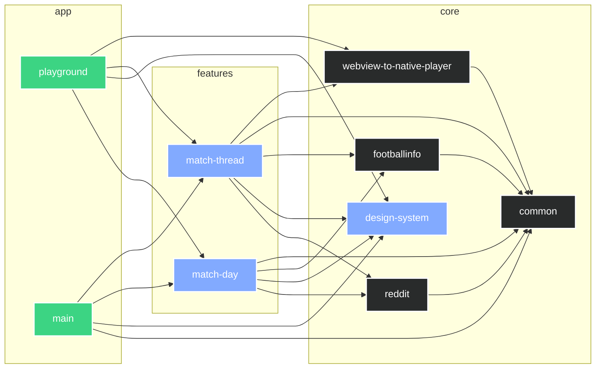

[](https://github.com/iurysza/module-graph/actions?query=workflow%3A%22Pre+Merge+Checks%22) [](LICENSE) 

<p align="center">
  
</p>

## Module Graph Plugin

This plugin generates a [Mermaid](https://github.com/mermaid-js/mermaid) graph of your project's module relationships,
so you can see how your modules interact at a glance.


> A diagram about the current system is only useful if it's generated. If it is produced by hand it
> documents the author's belief, not the system. Still, important, but not an input for decision
> making. Development is primarily decision-making. Enable it through custom
> tools. [source](https://twitter.com/girba/status/1628326848256962561)

You can read more about the background story of this
plugin [here](https://iurysouza.dev/automating-project-architecture-graphs/).

## Main Features ⭐

- Automatically append/update the generated graph to your project's README file.
- Enables you to focus and highlight specific nodes in the graph
- Exclude specific configurations from the graph.
- Built in themes and customization options.
- The raw code block automatically renders as a graph on
  both [GitHub](https://github.blog/2022-02-14-include-diagrams-markdown-files-mermaid/),
  [Gitlab](https://about.gitlab.com/handbook/tools-and-tips/mermaid/#mermaid-diagrams), [Jetbrains IDEs](https://plugins.jetbrains.com/plugin/20146-mermaid)
  and [VSCode ](https://marketplace.visualstudio.com/items?itemName=MermaidChart.vscode-mermaid-chart).

## Getting Started

You'll just need to add it to your project's **root** `build.gradle` or `build.gradle.kts` file.

<details>
  <summary><b>build.gradle (Groovy DSL)</b></summary>

#### Using the plugins DSL

```groovy
plugins {
    id "dev.iurysouza.modulegraph" version "0.7.0"
}
```

<details>
  <summary><b>Using Legacy Plugin application</b></summary>

```groovy
    buildscript {
    repositories {
        maven {
            url "https://plugins.gradle.org/m2/"
        }
    }
    dependencies {
        classpath "dev.iurysouza:modulegraph:0.7.0"
    }
}

apply plugin: "dev.iurysouza.modulegraph"
```

</details>

### Configuring the plugin

```groovy
import dev.iurysouza.modulegraph.LinkText
import dev.iurysouza.modulegraph.ModuleType
import dev.iurysouza.modulegraph.Orientation
import dev.iurysouza.modulegraph.Theme

moduleGraphConfig {
    readmePath = "./README.md"
    heading = "### Module Graph"
    showFullPath = false // optional
    orientation = Orientation.LEFT_TO_RIGHT // optional
    linkText = LinkText.NONE // optional
    excludedConfigurationsRegex = ".*test.*" // optional
    excludedModulesRegex = ".*moduleName.*" // optional
    focusedModulesRegex = ".*(projectName).*" // optional
    setStyleByPluginType = true // optional
    theme = Theme.NEUTRAL // optional
    // Or you can fully customize it by using the BASE theme:
    // theme = new Theme.BASE(
    //     [
    //         "primaryTextColor": "#F6F8FAff", // All text colors
    //         "primaryColor": "#5a4f7c", // Node color
    //         "primaryBorderColor": "#5a4f7c", // Node border color
    //         "tertiaryColor": "#40375c", // Container box background
    //         "lineColor": "#f5a623",
    //         "fontSize": "12px"
    //     ],
    //     focusColor = "#F5A622" // Color of the focused nodes if any
    // )
    // theme.set(
    //     new Theme.BASE(
    //         themeVariables: [
    //             "primaryTextColor": "#F6F8FAff", // All text colors
    //             "primaryColor": "#5a4f7c", // Node color
    //             "primaryBorderColor": "#5a4f7c", // Node border color
    //             "tertiaryColor": "#40375c", // Container box background
    //             "lineColor": "#f5a623",
    //             "fontSize": "12px"
    //         ],
    //         focusColor: "#F5A622", // Color of the focused nodes if any
    //         moduleTypes: [
    //             new ModuleType.AndroidLibrary("#2C4162")
    //         ]
    //     )
    // )

}
```

</details>

<p></p>

<details open>
<summary><b>build.gradle.kts (Kotlin DSL)</b></summary>

<p></p>

#### Using the plugins DSL

```kotlin
plugins {
    id("dev.iurysouza.modulegraph") version "0.7.0"
}
```

<details>
  <summary><b>Using Legacy Plugin application</b></summary>

```kotlin
    buildscript {
    repositories {
        maven {
            url = uri("https://plugins.gradle.org/m2/")
        }
    }
    dependencies {
        classpath("dev.iurysouza:modulegraph:0.7.0")
    }
}

apply(plugin = "dev.iurysouza:modulegraph")
```

</details>

### Configuring the plugin

```kotlin
import dev.iurysouza.modulegraph.LinkText
import dev.iurysouza.modulegraph.ModuleType
import dev.iurysouza.modulegraph.Orientation
import dev.iurysouza.modulegraph.Theme

moduleGraphConfig {
    readmePath.set("./README.md")
    heading = "### Module Graph"
    showFullPath.set(false) // optional
    orientation.set(Orientation.LEFT_TO_RIGHT) //optional
    linkText.set(LinkText.NONE) // optional
    setStyleByPluginType.set(true) // optional
    excludedConfigurationsRegex.set(".*test.*") // optional
    excludedModulesRegex.set(".*moduleName.*") // optional
    focusedModulesRegex.set(".*(projectName).*") // optional
    theme.set(Theme.NEUTRAL) // optional
    // or you can fully customize it by using the BASE theme:
    // Theme.BASE(
    //     themeVariables = mapOf(
    //         "primaryTextColor" to "#F6F8FAff", // Text
    //         "primaryColor" to "#5a4f7c", // Node
    //         "primaryBorderColor" to "#5a4f7c", // Node border
    //         "tertiaryColor" to "#40375c", // Container box background
    //         "lineColor" to "#f5a623",
    //         "fontSize" to "12px",
    //     ),
    //     focusColor = "#F5A622",
    //     moduleTypes = listOf(
    //         ModuleType.AndroidLibrary("#2C4162"),
    //     )
    // ),
    // )
}
```

</details>

## Usage

Make sure you have a heading in your `README` with the same format as the one you set in the
configuration, if not, the plugin will append it with the graph to the end of the file.

After that, just run the following command:

```sh
./gradlew createModuleGraph
```

Now, just look for the generated graph in your project's README file.

## Configuration Docs

Required settings:

- **readmePath**: The path of the file where the dependency graph will be added.
- **heading**: The heading where the dependency graph will be added.

Optional settings:

- **setStyleByPluginType**: Whether to style the modules based on their type (KotlinMultiplatform, Android Library, etc). Default is `false`. [Read more](#module-type-based-styling).
- **focusedModulesRegex**: The regex to match nodes in the graph (project names) that should be focused. By
  default, no nodes are focused.
  If set, the matching nodes will be highlighted and only related nodes will be shown. The color can be customized via the `focusColor` property
  from `Theme.BASE`. [Read more](#focusing-on-specific-nodes).
- **showFullPath**: Whether to show the full path of the modules in the graph. Default is `false`. This removes subgraphs.
- **theme**: The [mermaid theme](https://mermaid.js.org/config/theming.html) to be used for styling
  the graph. Default is `NEUTRAL`.
    - Further customization is possible by setting the `themeVariables` property on the `BASE` theme. Check the
      [mermaid docs](https://mermaid-js.github.io/mermaid/#/theming) for more info.
- **orientation**:
  The [orientation](https://mermaid.js.org/syntax/flowchart.html#flowchart-orientation) that the
  flowchart will have. Default is `LEFT_TO_RIGHT`.
- **linkText**:
  Whether to add information as text on links in graph. Available values:
    - `NONE`: No text added. (Default.)
    - `CONFIGURATION`: The name of the configuration which the dependency belongs to (e.g. "
      implementation", "compileOnly", "jsMain").
- **excludedConfigurationsRegex**:
    - Regex matching the configurations which should be ignored. e.g. "implementation", "testImplementation".
- **excludedModulesRegex**:
    - Regex matching the modules which should be ignored.

### Show me that graph!

This is an example of using the plugin on an Android project with a multimodule setup.
Here, the following configuration was used:

```kotlin
moduleGraphConfig {
    readmePath.set("${rootDir}/README.md")
    heading.set("### Module Graph")
    theme.set(
        Theme.BASE(
            mapOf(
                "primaryTextColor" to "#fff",
                "primaryColor" to "#5a4f7c",
                "primaryBorderColor" to "#5a4f7c",
                "lineColor" to "#f5a623",
                "tertiaryColor" to "#40375c",
                "fontSize" to "12px",
            ),
            focusColor = "#FA8140"
        ),
    )
}
```

And we got this graph:



Too much information? We can fix that.

## Focusing on specific nodes

If you want to focus on specific nodes in the graph, you can use the `focusedModulesRegex` property in the
configuration.

```kotlin
moduleGraphConfig {
    //... keep previous configs
    focusedModulesRegex.set(".*(reddit).*")
}
```

By doing this, the plugin will highlight the nodes that match the pattern, and will only show the other nodes that are
connected to them.
It will generate the following graph:



Since it's just a regex pattern, you can, for example, match multiple nodes by using the `|` operator,
or you can come up with whatever cryptic regex patterns you want if you're into that kind of thing.

When was the last time Regex made you happy? =)

```kotlin
// This matches module names that contain "reddit" or "match-day"
focusedModulesRegex.set(".*(reddit|match-day).*")
```



## Module type based styling

This feature enables detecting and rendering modules based on their type, eg.: kotlin, java, android-library,
kotlin-multiplatform, etc

### Getting Started

Just toggle this option on:

```kotlin
moduleGraphConfig {
    //..
    setStyleByPluginType.set(true)
}
```

That's it. Just run the task and you'll get a graph identifying modules by their type.

### Batteries included

We have default styling for these module types:

- Android Application
- React Native
- Kotlin Multiplatform
- Android Library
- Kotlin
- Java Library
- Java

These supported plugins are pre-configured with a default color pattern, but can be customized further if needed. **You
can also add you own module type.**

### Customization

The **supported plugins already have a default color pattern** , but you can also customize them via the `Theme.BASE`
object.

Additionally, you can detect and customize styling for **other plugins** by providing a `CustomPlugin` with an `id` and
its color. The `ID` will be used to match a Gradle plugin applied to that module and will have higher precedence than
all the others. For example, if you have a plugin defined with the `app.compose` id, you can pass it
as `Custom("app.compose", "#0E0E0E")` and the graph will be generated accordingly.
eg.:

```kotlin
import dev.iurysouza.modulegraph.ModuleType.*
import dev.iurysouza.modulegraph.Theme

moduleGraphConfig {
    theme.set(
        Theme.BASE(
            moduleTypes = listOf(
                Custom(id = "app.compose", color = "#0E0E0E"),
                AndroidApp("#3CD483"),
                AndroidLibrary("#292B2B"),
            ),
        ),
    )
}
```

Below is an example of how the module graph would show up:



> [!NOTE]
> Modules can only have one type. So we're using a hardcoded precedence order for identifying them.
>

### Precedence

The system determines the module type based on the hierarchy of applied plugins. For instance:

- A module with both `React Native` and `Android Library` will be identified as `React Native`.
- A module with both `Android Library` and `Kotlin` will be identified as `Android Library`.

## Contributing 🤝

Feel free to open an issue or submit a pull request for any bugs/improvements.

## License 📄

This project is licensed under the MIT License - see the [License](License) file for details.

## Buy Me a Coffee

If you found this project useful or want to support the development, consider buying me a coffee! Any donations are
greatly appreciated and help to support the development. [Relevant xkcd](https://xkcd.com/2347/).

<a href="https://www.buymeacoffee.com/iurysza" target="_blank">

</a>
