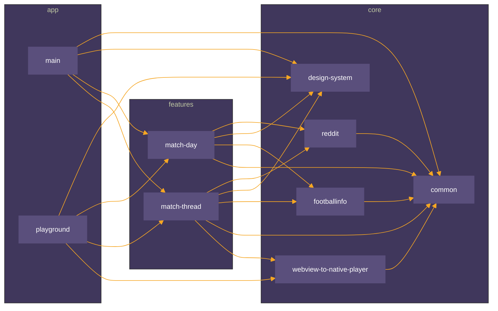
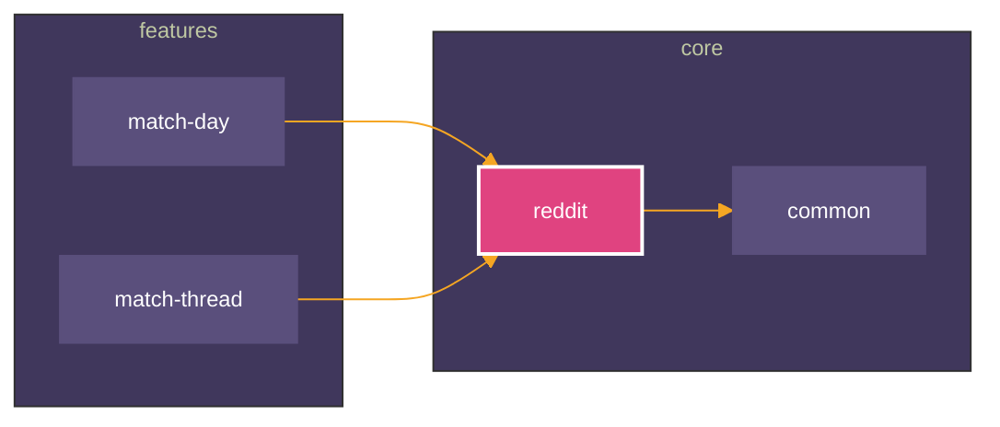
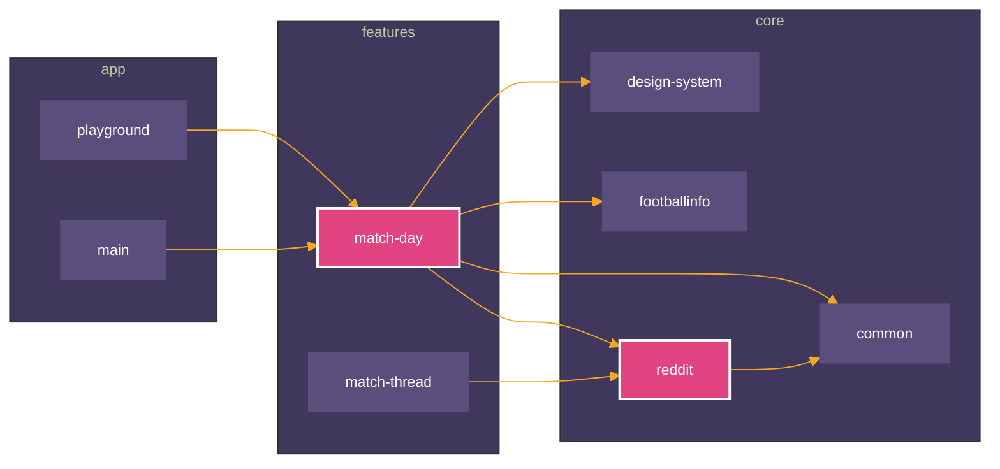
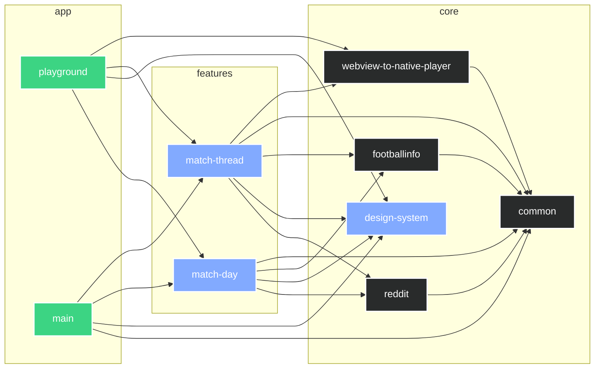
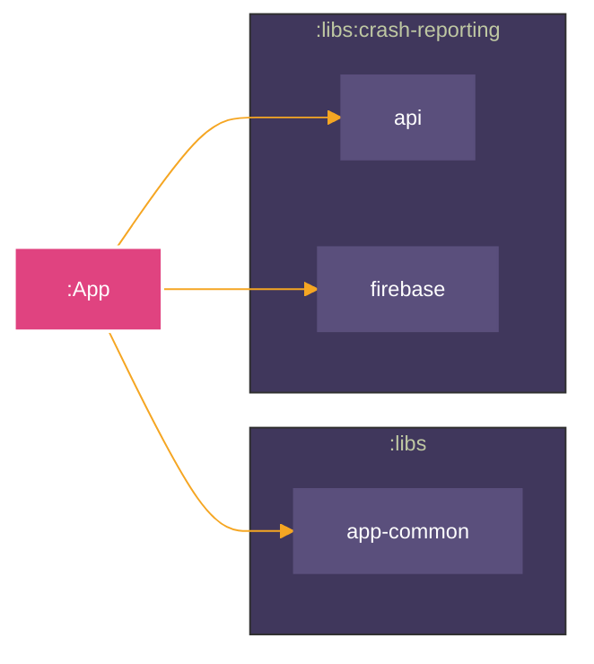
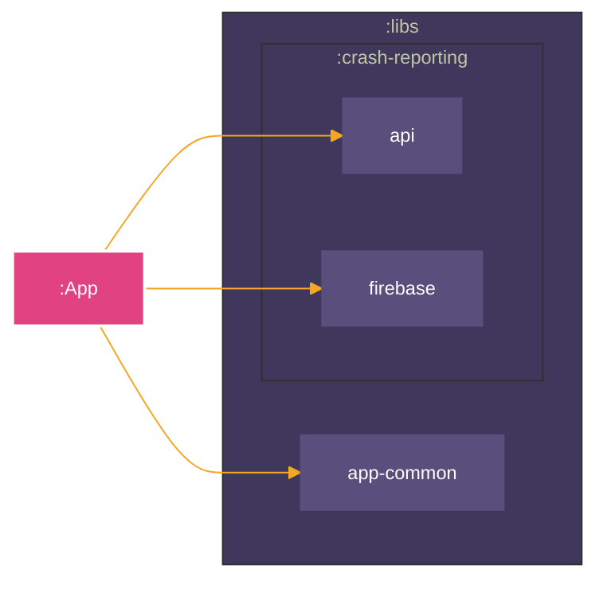
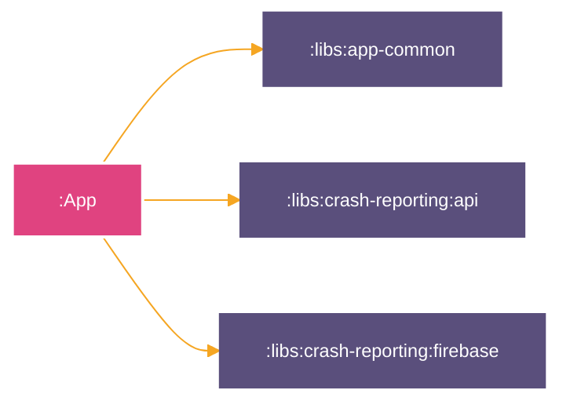

[](https://github.com/iurysza/module-graph/actions?query=workflow%3A%22Pre+Merge+Checks%22) [](LICENSE) 

<p align="center">
    
</p>

## Module Graph Plugin

This plugin generates a [Mermaid](https://github.com/mermaid-js/mermaid) graph of your project's module relationships,
so you can see how your modules interact at a glance.


> A diagram about the current system is only useful if it's generated. If it is produced by hand it
> documents the author's belief, not the system. Still, important, but not an input for decision
> making. Development is primarily decision-making. Enable it through custom
> tools. [source](https://twitter.com/girba/status/1628326848256962561)

You can read more about the background story of this
plugin [here](https://iurysouza.dev/automating-project-architecture-graphs/).

## Main Features ⭐

- Automatically append/update the generated graph to your project's README file.
- Enables you to focus and highlight specific nodes in the graph
- Exclude specific configurations from the graph.
- Built in themes and customization options.
- The raw code block automatically renders as a graph on
  both [GitHub](https://github.blog/2022-02-14-include-diagrams-markdown-files-mermaid/),
  [Gitlab](https://about.gitlab.com/handbook/tools-and-tips/mermaid/#mermaid-diagrams), [Jetbrains IDEs](https://plugins.jetbrains.com/plugin/20146-mermaid)
  and [VSCode ](https://marketplace.visualstudio.com/items?itemName=MermaidChart.vscode-mermaid-chart).

## Getting Started

You'll just need to add it to your project's **root** `build.gradle` or `build.gradle.kts` file.

<details>
  <summary><b>build.gradle (Groovy DSL)</b></summary>

#### Using the plugins DSL

```groovy
plugins {
    id "dev.iurysouza.modulegraph" version "0.12.0"
}
```

<details>
  <summary><b>Using Legacy Plugin application</b></summary>

```groovy
    buildscript {
    repositories {
        maven {
            url "https://plugins.gradle.org/m2/"
        }
    }
    dependencies {
        classpath "dev.iurysouza:modulegraph:0.12.0"
    }
}

apply plugin: "dev.iurysouza.modulegraph"
```

</details>

<details>
  <summary><b>Configuration Properties</b></summary>

```groovy
import dev.iurysouza.modulegraph.LinkText
import dev.iurysouza.modulegraph.ModuleType
import dev.iurysouza.modulegraph.Orientation
import dev.iurysouza.modulegraph.Theme

moduleGraphConfig {
    // readmePath = "./README.md"
    // heading = "### Module Graph"
    // showFullPath = false
    // orientation = Orientation.LEFT_TO_RIGHT
    // linkText = LinkText.NONE
    // excludedConfigurationsRegex = ".*test.*"
    // excludedModulesRegex = ".*moduleName.*"
    // focusedModulesRegex = ".*(projectName).*"
    // rootModulesRegex = ".*moduleName.*"
    // setStyleByModuleType = true
    // strictMode = false
    // nestingEnabled = true

    // theme = Theme.NEUTRAL
    // Or you can fully customize it by using the BASE theme:
    // theme = new Theme.BASE(
    //     [
    //         "primaryTextColor": "#F6F8FAff", // All text colors
    //         "primaryColor": "#5a4f7c", // Node color
    //         "primaryBorderColor": "#5a4f7c", // Node border color
    //         "tertiaryColor": "#40375c", // Container box background
    //         "lineColor": "#f5a623",
    //         "fontSize": "12px"
    //     ],
    //     focusColor = "#F5A622" // Color of the focused nodes if any
    // )
    // theme.set(
    //     new Theme.BASE(
    //         themeVariables: [
    //             "primaryTextColor": "#F6F8FAff", // All text colors
    //             "primaryColor": "#5a4f7c", // Node color
    //             "primaryBorderColor": "#5a4f7c", // Node border color
    //             "tertiaryColor": "#40375c", // Container box background
    //             "lineColor": "#f5a623",
    //             "fontSize": "12px"
    //         ],
    //         focusColor: "#F5A622", // Color of the focused nodes if any
    //         moduleTypes: [
    //             new ModuleType.AndroidLibrary("#2C4162")
    //         ]
    //     )
    // )

    // You can add additional graphs.
    // A separate graph will be generated for each config below.
    // graph(
    //     "./README.md",
    //     "# Graph with root: gama",
    // ) {
    //     it.rootModulesRegex = ".*gama.*"
    // }
    // graph(
    //     "./SomeOtherReadme.md",
    //     "# Graph",
    // ) {
    //     it.rootModulesRegex = ".*zeta.*"
    // }

}
```

</details>
</details>

<br>

<details open>
<summary><b>build.gradle.kts (Kotlin DSL)</b></summary>

<p></p>

#### Using the plugins DSL

```kotlin
plugins {
    id("dev.iurysouza.modulegraph") version "0.12.0"
}
```

<details>
  <summary><b>Using Legacy Plugin application</b></summary>

```kotlin
    buildscript {
    repositories {
        maven {
            url = uri("https://plugins.gradle.org/m2/")
        }
    }
    dependencies {
        classpath("dev.iurysouza:modulegraph:0.12.0")
    }
}

apply(plugin = "dev.iurysouza.modulegraph")
```

</details>

<details>
  <summary><b>Configuration Properties</b></summary>

```kotlin
import dev.iurysouza.modulegraph.LinkText
import dev.iurysouza.modulegraph.ModuleType
import dev.iurysouza.modulegraph.Orientation
import dev.iurysouza.modulegraph.Theme

moduleGraphConfig {
    // readmePath.set("./README.md")
    // heading.set("### Module Graph")
    // showFullPath.set(false)
    // orientation.set(Orientation.LEFT_TO_RIGHT)
    // linkText.set(LinkText.NONE)
    // setStyleByModuleType.set(true)
    // excludedConfigurationsRegex.set(".*test.*")
    // excludedModulesRegex.set(".*moduleName.*")
    // focusedModulesRegex.set(".*(projectName).*")
    // rootModulesRegex.set(".*moduleName.*")
    // strictMode.set(false)
    // nestingEnabled.set(true)

    // theme.set(Theme.NEUTRAL) // optional
    // or you can fully customize it by using the BASE theme:
    // Theme.BASE(
    //     themeVariables = mapOf(
    //         "primaryTextColor" to "#F6F8FAff", // Text
    //         "primaryColor" to "#5a4f7c", // Node
    //         "primaryBorderColor" to "#5a4f7c", // Node border
    //         "tertiaryColor" to "#40375c", // Container box background
    //         "lineColor" to "#f5a623",
    //         "fontSize" to "12px",
    //     ),
    //     focusColor = "#F5A622",
    //     moduleTypes = listOf(
    //         ModuleType.AndroidLibrary("#2C4162"),
    //     )
    // ),
    // )

    // You can include additional graphs.
    // A separate graph will be generated for each config below.
    // graph(
    //     readmePath = "./README.md",
    //     heading = "# Graph with root: gama",
    // ) {
    //     rootModulesRegex = ".*gama.*"
    // }
    // graph(
    //     readmePath = "./SomeOtherReadme.md",
    //     heading = "# Graph",
    // ) {
    //     rootModulesRegex = ".*zeta.*"
    // }
}
```

</details>
</details>

### Running it
You can run the plugin's task right away without any extra configuration. The plugin tries to provide sensible defaults, so after applying it to your project you can:

```sh
./gradlew createModuleGraph
```

This will generate a module graph in your README file. If you need further customization, keep reading for more detailed examples of how to configure it.


## Configuration Docs

Each Graph has the following configuration parameters.

Optional settings:

- **readmePath**: The path of the file where the dependency graph will be added. Defaults to "README.md" in the root directory of the project.
- **heading**: The heading where the dependency graph will be added. Defaults to "# Primary Graph".
- **setStyleByModuleType**: Whether to style the modules based on their type (KotlinMultiplatform, Android Library, etc.). Default is `false`. [Read more](#module-type-based-styling).
- **nestingEnabled**: Whether to enable nested subgraphs in the generated graph. Groups modules into subgraphs based on their path structure. Default is `false`. [Read more](#nested-subgraphs).
- **focusedModulesRegex**: The regex to match nodes in the graph (project names) that should be focused. By
  default, no nodes are focused.
  If set, the matching nodes will be highlighted and only related nodes will be shown. The color can be customized via the `focusColor` property
  from `Theme.BASE`. [Read more](#focusing-on-specific-nodes).
- **showFullPath**: Whether to show the full path of the modules in the graph. Default is `false`. This removes sub-graphs.
- **theme**: The [mermaid theme](https://mermaid.js.org/config/theming.html) to be used for styling
  the graph. Default is `NEUTRAL`.
    - Further customization is possible by setting the `themeVariables` property on the `BASE` theme. Check the
      [mermaid docs](https://mermaid-js.github.io/mermaid/#/theming) for more info.
- **orientation**:
  The [orientation](https://mermaid.js.org/syntax/flowchart.html#flowchart-orientation) that the
  flowchart will have. Default is `LEFT_TO_RIGHT`.
- **linkText**:
  Whether to add information as text on links in graph. Available values:
    - `NONE`: No text added. (Default.)
    - `CONFIGURATION`: The name of the configuration which the dependency belongs to (e.g. "
      implementation", "compileOnly", "jsMain").
- **excludedConfigurationsRegex**:
    - Regex matching the configurations which should be ignored. e.g. "implementation", "testImplementation".
- **excludedModulesRegex**:
    - Regex matching the modules which should be ignored when traversing dependencies.
    - When a module matches this pattern, it and its dependencies will be excluded from the graph.
    - Note: This only excludes modules when they appear as dependencies. If a module matches this pattern but is also selected as a root module (either explicitly via `rootModulesRegex` or implicitly when `rootModulesRegex` is not set), it will still appear in the graph.
- **rootModulesRegex**:
    - Regex matching the modules that should be used as starting points for building the graph.
    - If set, only these modules and their dependencies (direct and transitive) will be included in the graph.
    - If not set, all modules are considered root modules, which means the graph will include all modules and their dependencies.
    - This is useful when you want to focus on a specific part of your project's dependency structure.

### Multiple graphs

You can apply configuration options directly in the root of the `moduleGraphConfig` block like so:

```kotlin
moduleGraphConfig {
    readmePath.set("${rootDir}/README.md")
    heading.set("### Module Graph")
    showFullPath.set(false)
}
```

When you do this, you are configuring the 'Primary Graph'.
This is useful if you only need one graph to be generated.

But sometimes you want multiple graphs to be generated.
To achieve this you can add additional graph configs using `graph`.
Each additional graph has exactly the same configuration parameters as the primary graph:

```kotlin
moduleGraphConfig {
    graph(
        readmePath = "${rootDir}/README.md",
        heading = "### Module Graph",
    ) {
        showFullPath = false
    }
}
```

Note that `graph` requires the required parameters to be provided in the function call,
while the optional parameters can be provided in the configuration block.

You can add as many `graph` calls as you like: each one will generate a separate graph:

```kotlin
moduleGraphConfig {
    graph(
        readmePath = "${rootDir}/README.md",
        heading = "### Module Graph",
    ) {
        showFullPath = false
    }
    graph(
        readmePath = "${rootDir}/README.md",
        heading = "### Another Module Graph",
    ) {
        showFullPath = true
    }
}
```

For this plugin to work, you need to configure at least one graph.
This can be via the Primary Graph, or via a `graph` call.

If using only `graph` calls, then the Primary Graph doesn't need to be setup at all!
You can see this in the samples above.

### Show me that graph!

This is an example of using the plugin on an Android project with a multi-module setup.
Here, the following configuration was used:

```kotlin
moduleGraphConfig {
    readmePath.set("${rootDir}/README.md")
    heading.set("### Module Graph")
    theme.set(
        Theme.BASE(
            mapOf(
                "primaryTextColor" to "#fff",
                "primaryColor" to "#5a4f7c",
                "primaryBorderColor" to "#5a4f7c",
                "lineColor" to "#f5a623",
                "tertiaryColor" to "#40375c",
                "fontSize" to "12px",
            ),
            focusColor = "#FA8140"
        ),
    )
}
```

And we got this graph:



Too much information? We can fix that.

## Focusing on specific nodes

If you want to focus on specific nodes in the graph, you can use the `focusedModulesRegex` property in the
configuration.

```kotlin
moduleGraphConfig {
    //... keep previous configs
    focusedModulesRegex.set(".*(reddit).*")
}
```

By doing this, the plugin will highlight the nodes that match the pattern, and will only show the other nodes that are
connected to them.
It will generate the following graph:



Since it's just a regex pattern, you can, for example, match multiple nodes by using the `|` operator,
or you can come up with whatever cryptic regex patterns you want if you're into that kind of thing.

When was the last time Regex made you happy? =)

```kotlin
// This matches module names that contain "reddit" or "match-day"
focusedModulesRegex.set(".*(reddit|match-day).*")
```



## Module type based styling

This feature enables detecting and rendering modules based on their type, eg.: kotlin, java, android-library,
kotlin-multiplatform, etc

### Getting Started

Just toggle this option on:

```kotlin
moduleGraphConfig {
    //..
    setStyleByModuleType.set(true)
}
```

That's it. Just run the task and you'll get a graph identifying modules by their type.

### Batteries included

We have default styling for these module types:

- Android Application
- React Native
- Kotlin Multiplatform
- Android Library
- Kotlin
- Java Library
- Java

These supported plugins are pre-configured with a default color pattern, but can be customized further if needed. **You
can also add you own module type.**

### Customization

The **supported plugins already have a default color pattern** , but you can also customize them via the `Theme.BASE`
object.

Additionally, you can detect and customize styling for **other plugins** by providing a `CustomPlugin` with an `id` and
its color. The `ID` will be used to match a Gradle plugin applied to that module and will have higher precedence than
all the others. For example, if you have a plugin defined with the `app.compose` id, you can pass it
as `Custom("app.compose", "#0E0E0E")` and the graph will be generated accordingly.
eg.:

```kotlin
import dev.iurysouza.modulegraph.ModuleType.*
import dev.iurysouza.modulegraph.Theme

moduleGraphConfig {
    theme.set(
        Theme.BASE(
            moduleTypes = listOf(
                Custom(id = "app.compose", color = "#0E0E0E"),
                AndroidApp("#3CD483"),
                AndroidLibrary("#292B2B"),
            ),
        ),
    )
}
```

Below is an example of how the module graph would show up:



> [!NOTE]
> Modules can only have one type. So we're using a hardcoded precedence order for identifying them.

### Precedence

The system determines the module type based on the hierarchy of applied plugins. For instance:

- A module with both `React Native` and `Android Library` will be identified as `React Native`.
- A module with both `Android Library` and `Kotlin` will be identified as `Android Library`.

## Nested Subgraphs

The plugin supports two ways of organizing modules in the graph: flat subgraphs (default) and nested subgraphs. You can enable nested subgraphs using the `nestingEnabled` property:

```kotlin
moduleGraphConfig {
    //... keep previous configs
    nestingEnabled.set(true)
}
```

### Flat vs Nested Example

Given these modules:
- :App
- :libs:crash-reporting:api
- :libs:crash-reporting:firebase
- :libs:app-common

**Flat subgraphs** (default):


**Nested subgraphs** (with `nestingEnabled = true`):


Nested subgraphs can help better visualize your project's module hierarchy, especially in larger projects with many nested modules. Note that this feature is automatically disabled if `showFullPath` is true.

### Full Path View

You can also choose to show the full path of each module using the `showFullPath` property:

```kotlin
moduleGraphConfig {
    //... keep previous configs
    showFullPath.set(true)
}
```

This will display the complete path for each module without any subgraph grouping:



This view can be useful when you want to see the full module paths at a glance without any grouping structure.


```kotlin
moduleGraphConfig {
    // ... other config ...

    // Example: Include only modules under the 'features' directory as roots,
    // and exclude any test modules
    rootModulesRegex.set(".*:features:.*")
    excludedModulesRegex.set(".*test.*")
}
```

### Common Module Filtering Scenarios

```kotlin
// Scenario 1: Show everything ✅
moduleGraphConfig {
    // No filters - shows all modules and all dependencies
}

// Scenario 2: Show only feature modules and what they depend on ✅
moduleGraphConfig {
    rootModulesRegex.set(":features:.*")
    // Result:
    // - Shows all :features:* modules
    // - Shows only dependencies of feature modules
}
```


#### Excluding Modules

To effectively exclude certain modules from your graph, you need to:

1. Set `rootModulesRegex` to match your desired root modules
2. Set `excludedModulesRegex` to match the modules you want to ignore

```kotlin
// Scenario 3: Try to exclude feature modules ❌
moduleGraphConfig {
    // Don't set rootModulesRegex (all modules are roots)
    excludedModulesRegex.set(":features:.*")
    // Result:
    // - Shows ALL modules (because they're all roots)
    // - The exclusion pattern has no effect since all modules are roots
}

// Scenario 3 (CORRECT WAY): Focus on app module, ignore feature modules ✅
moduleGraphConfig {
    rootModulesRegex.set(":app")
    excludedModulesRegex.set(":features:.*")
    // Result:
    // - Shows :app module
    // - Shows its dependencies (except feature modules)
    // - Shows dependencies of dependencies (except feature modules)
}
```

If you don't set `rootModulesRegex`, all modules will be considered root modules and cannot be excluded, even if they match `excludedModulesRegex`.

## Contributing 🤝

Feel free to open an issue or submit a pull request for any bugs/improvements.

## License 📄

This project is licensed under the MIT License - see the [License](./LICENSE) file for details.

## Buy Me a Coffee

If you found this project useful or want to support the development, consider buying me a coffee! Any donations are
greatly appreciated and help to support the development. [Relevant xkcd](https://xkcd.com/2347/).

<a href="https://www.buymeacoffee.com/iurysza" target="_blank">

</a>