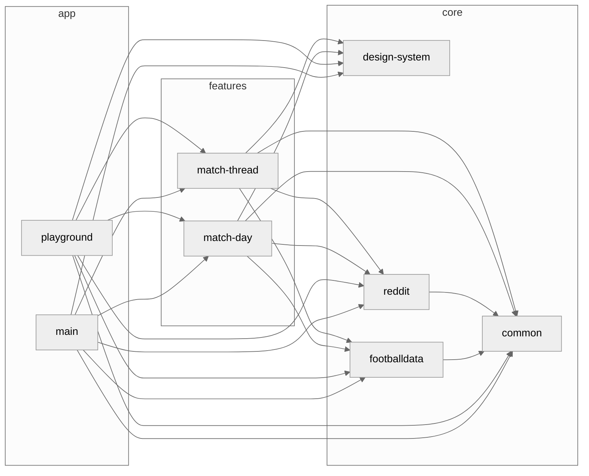

[](https://github.com/iurysza/module-graph/actions?query=workflow%3A%22Pre+Merge+Checks%22) [](LICENSE) 

## Introducing the Gradle Module Graph Plugin! 🌟

This plugin generates a [Mermaid](https://github.com/mermaid-js/mermaid) graph for your Gradle
project, providing a visual representation of your project's module relationships. By illustrating
how the parts of the project are connected, it makes it easier to understand the design and how they
depend on each other.

> A diagram about the current system is only useful if it's generated. If it is produced by hand it
> documents the author's belief, not the system. Still, important, but not an input for decision
> making. Development is primarily decision making. Enable it through custom
> tools. [source](https://twitter.com/girba/status/1628326848256962561)

You can read more about the background story of this
plugin [here](https://iurysouza.dev/automating-project-architecture-graphs/).

## Features

- Generates a Mermaid dependency graph of the modules in your Gradle project.
- Automatically append the generated graph to your project's README file.
- The raw code block automatically renders as a graph on
  both [Github](https://github.blog/2022-02-14-include-diagrams-markdown-files-mermaid/)
  and [Gitlab](https://about.gitlab.com/handbook/tools-and-tips/mermaid/#mermaid-diagrams).

## Getting Started

You'll just need to add it to your project's **root** `build.gradle` or `build.gradle.kts` file.

<details>
  <summary><b>build.gradle (Groovy DSL)</b></summary>

#### Using the plugins DSL

```groovy
plugins {
    id "dev.iurysouza.modulegraph" version "0.4.0"
}
```
<details>
  <summary><b>Using Legacy Plugin application</b></summary>

```groovy
    buildscript {
        repositories {
            maven {
                url "https://plugins.gradle.org/m2/"
            }
        }
        dependencies {
            classpath "dev.iurysouza:modulegraph:0.4.0"
        }
    }

    apply plugin: "dev.iurysouza.modulegraph"
```
</details>

### Configuring the plugin

```groovy
  moduleGraphConfig {
    readmePath = "./README.md"
    heading = '### Dependency Diagram'
    showFullPath = false // optional
    theme = Theme.NEUTRAL // optional
    orientation = Orientation.LEFT_TO_RIGHT // optional
    linkText = LinkText.NONE // optional
    // or you can fully customize it by using the BASE theme:
    // theme = Theme.BASE(
    //      [
    //          "primaryTextColor": "#fff",
    //          "primaryColor": "#5a4f7c",
    //          "primaryBorderColor": "#5a4f7c",
    //          "lineColor": "#f5a623",
    //          "tertiaryColor": "#40375c",
    //          "fontSize": "11px"
    //      ]
    //  )
}
```

</details>

<p></p>

<details open>
<summary><b>build.gradle.kts (Kotlin DSL)</b></summary>

<p></p>

#### Using the plugins DSL

```kotlin
plugins {
    id("dev.iurysouza.modulegraph") version "0.4.0"
}
```

<details>
  <summary><b>Using Legacy Plugin application</b></summary>

```kotlin
    buildscript {
        repositories {
            maven {
                url = uri("https://plugins.gradle.org/m2/")
            }
        }
        dependencies {
            classpath("dev.iurysouza:modulegraph:0.4.0")
        }
    }

apply(plugin = "dev.iurysouza:modulegraph")
```
</details>

### Configuring the plugin

```kotlin
moduleGraphConfig {
    readmePath.set("./README.md")
    heading.set("### Dependency Diagram")
    showFullPath.set(false) // optional
    orientation.set(Orientation.LEFT_TO_RIGHT) //optional
    linkText.set(LinkText.NONE) // optional
    theme.set(Theme.NEUTRAL) // optional
    // or you can fully customize it by using the BASE theme:
    // theme.set(Theme.BASE(
    //      mapOf(
    //          "primaryTextColor" to "#fff",
    //          "primaryColor" to "#5a4f7c",
    //          "primaryBorderColor" to "#5a4f7c",
    //          "lineColor" to "#f5a623",
    //          "tertiaryColor" to "#40375c",
    //          "fontSize" to "11px"
    //      )
    //   )
    // )
}
```

</details>

## Configuration

To configure the Gradle Module Dependency Graph Plugin, you can set the following options:

- **readmePath**: The path of the file where the dependency graph will be appended.
- **heading**: The heading where the dependency graph will be appended.

Optional settings:

- **showFullPath**: Whether to show the full path of the modules in the graph. Default is `false`. Use this if you have
  modules with the same name in different paths. This will remove the subgraphs from the graph.
- **theme**: The [mermaid theme](https://mermaid.js.org/config/theming.html) to be used for styling
  the graph. Default is `NEUTRAL`.
  - Further customization is possible by setting the `themeVariables` property on the `BASE` theme. Check the
    [mermaid docs](https://mermaid-js.github.io/mermaid/#/theming) for more info.
- **orientation**:
  The [orientation](https://mermaid.js.org/syntax/flowchart.html#flowchart-orientation) that the
  flowchart will have. Default is `LEFT_TO_RIGHT`.
- **linkText**:
  Whether to add information as text on links in graph. Available values:
    - `NONE`: No text added. (Default.)
    - `CONFIGURATION`: The name of the configuration which the dependency belongs to (e.g. "
      implementation", "compileOnly", "jsMain").

## Usage

Make sure you have a heading in your `README` with the same format as the one you set in the
configuration, if
not, the plugin will append it with the graph to the end of the file.

After that, just run the following command:

```sh
./gradlew createModuleGraph
```

Now, just look for the generated graph in your project's README file.

### Example Diagram

You can expect the plugin to generate this kind of diagram after running the plugin:



## Contributing 🤝

Feel free to open an issue or submit a pull request for any bugs/improvements.

## License 📄

This template is licensed under the MIT License - see the [License](License) file for details.
