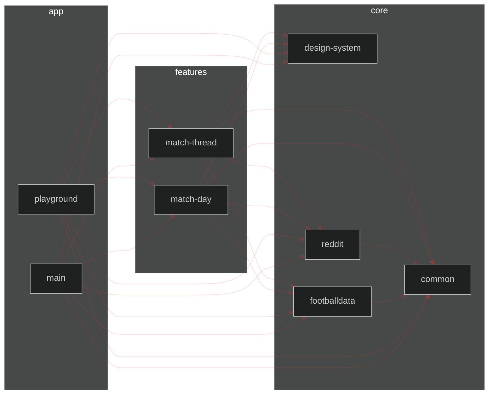

# Gradle Module Dependency Graph Plugin

[](https://github.com/iurysza/module-graph/actions?query=workflow%3A%22Pre+Merge+Checks%22) [](LICENSE) 

Introducing the Gradle Module Dependency Graph Plugin! 🌟

The Gradle Module Dependency Graph Plugin is a plugin that generates a [Mermaid](https://github.com/mermaid-js/mermaid) dependency graph for your Gradle project.
It provides a visual representation of your project's module dependencies, making it easier to understand the structure and relationships between modules.

## Features

- Generate a Mermaid dependency graph of your the modules in your Gradle project
- Automatically append the generated graph to your project's README file

## Getting Started

You'll just need to add it to your project's `build.gradle` or `build.gradle.kts` file.

<details>
  <summary><b>build.gradle (Groovy DSL)</b></summary>

```groovy
  createModuleGraph {
      readmeFile = file('README.md')
      heading = '## Custom Heading'
  }
```
</details>

<p></>

<details open>
  <summary><b>build.gradle.kts (Kotlin DSL)</b></summary>

```kotlin
createModuleGraph {
    readmeFile.set(file("README.md"))
    heading.set("## Custom Heading")
}
```
</details>

## Configuration

To configure the Gradle Module Dependency Graph Plugin, you can set the following options:

- `readmeFile`: The README file where the dependency graph will be appended. Default is the project's README file.
- `heading`: The heading where the dependency graph will be appended. Default is "## Module Dependency Graph".

## Usage

To generate the Mermaid dependency graph for your project, run the following command:

```sh
./gradlew createModuleGraph
```

## Sample Diagram

When ran you can expect it to generate this kind of diagram:



## Contributing 🤝

Feel free to open a issue or submit a pull request for any bugs/improvements.

## License 📄

This template is licensed under the MIT License - see the [License](License) file for details.
