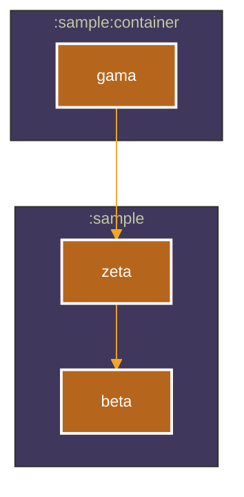

# Module Graph

```mermaid
%%{
  init: {
    'theme': 'base',
    'themeVariables': {"primaryTextColor":"#F6F8FAff","primaryColor":"#5a4f7c","primaryBorderColor":"#5a4f7c","tertiaryColor":"#40375c","lineColor":"#f5a623","fontSize":"12px"}
  }
}%%

graph TB
  subgraph :sample
    :sample:zeta["zeta"]
    :sample:beta["beta"]
  end
  subgraph :sample:container
    :sample:container:gama["gama"]
  end
  :sample:container:gama --> :sample:zeta
  :sample:zeta --> :sample:beta

classDef java fill:#B5661C,stroke:#fff,stroke-width:2px,color:#fff;
class :sample:container:gama java
class :sample:zeta java
class :sample:beta java

```