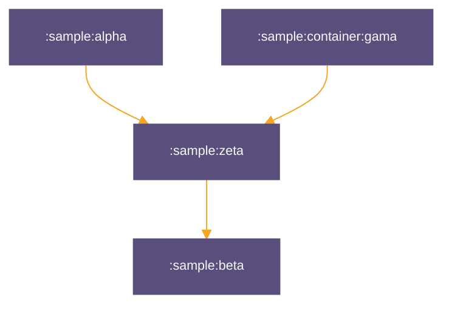

# Module Graph

```mermaid
%%{
  init: {
    'theme': 'base',
	'themeVariables': {"primaryTextColor":"#F6F8FAff","primaryColor":"#5a4f7c","primaryBorderColor":"#5a4f7c","lineColor":"#f5a623","tertiaryColor":"#40375c","fontSize":"11px"}
  }
}%%

graph TB
  :sample:zeta --> :sample:beta
  :sample:alpha --> :sample:zeta
  :sample:container:gama --> :sample:zeta
```
