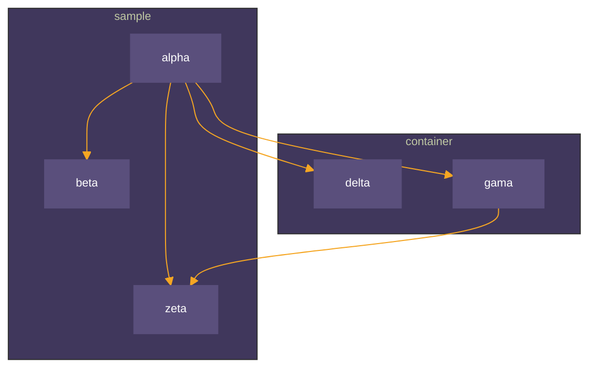

# Module Graph

```mermaid
%%{
  init: {
    'theme': 'base',
	'themeVariables': {"primaryTextColor":"#fff","primaryColor":"#5a4f7c","primaryBorderColor":"#5a4f7c","lineColor":"#f5a623","tertiaryColor":"#40375c","fontSize":"11px"}
  }
}%%

graph TB
  subgraph sample
    alpha
    beta
    zeta
  end
  subgraph container
    delta
    gama
  end
  alpha --> zeta
  alpha --> beta
  alpha --> gama
  alpha --> delta
  gama --> zeta
```