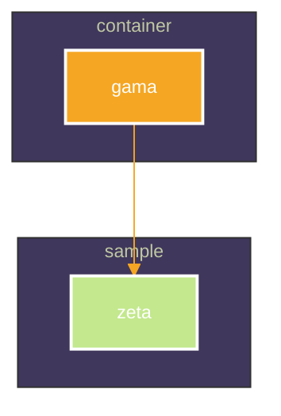

# Module Graph

```mermaid
%%{
  init: {
    'theme': 'base',
    'themeVariables': {"primaryTextColor":"#F6F8FAff","primaryColor":"#5a4f7c","primaryBorderColor":"#5a4f7c","tertiaryColor":"#40375c","lineColor":"#f5a623","fontSize":"12px"}
  }
}%%

graph TB
  subgraph container
    gama
  end
  subgraph sample
    zeta
  end
  gama --> zeta

classDef java fill:#C3E88D,stroke:#fff,stroke-width:2px,color:#fff;
class gama java
class zeta java

classDef focus fill:#F5A622,stroke:#fff,stroke-width:2px,color:#fff;
class gama focus
```