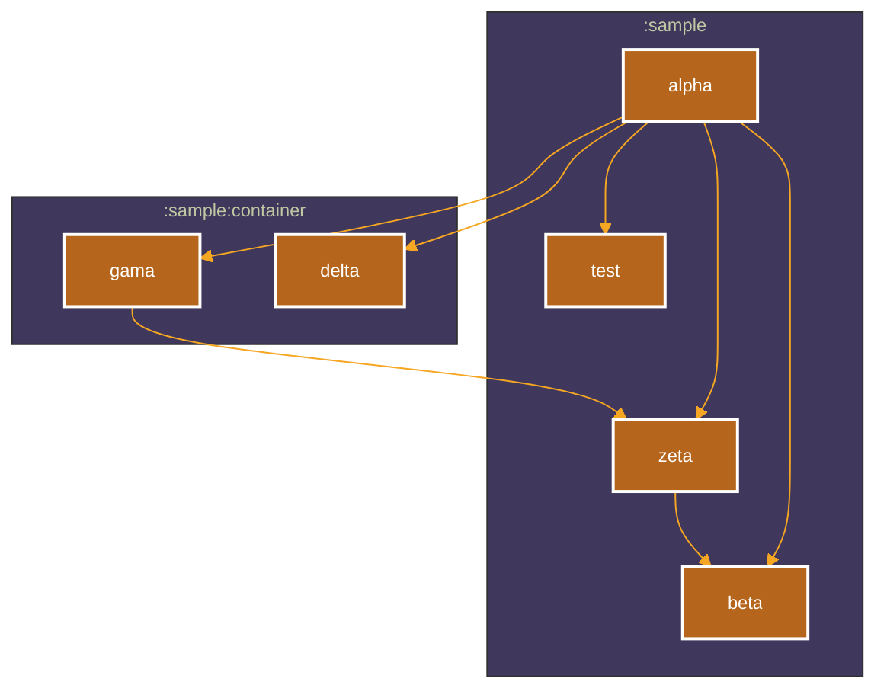

# Sample app

This is the sample app.
It has a simple module structure setup for testing out the graphs.
Some graphs will write to this file -
it's important to check they don't remove this existing content!

# 2 Build scripts?

This sample has no build scripts - one in Kotlin (kts) and one in Groovy.
This allows for testing the plugin in both languages.

Gradle only allows for 1 build script at a time,
so there should always be one script enabled, and the other should be disabled.
You can disable a build script by adding the `.x` extension to the end of the file name.
You can enable a build script by removing the `.x` extension, if present.

# Primary Graph


# Graph with root: gama

```mermaid
%%{
  init: {
    'theme': 'neutral'
  }
}%%

graph LR

```