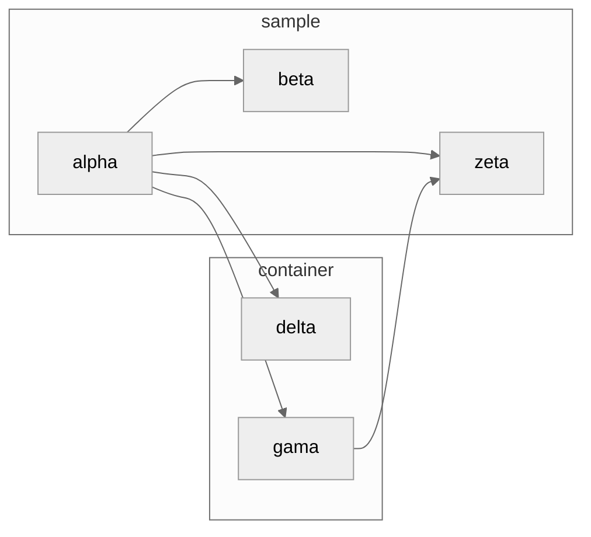

### Dependency Diagram

```mermaid
%%{
  init: {
    'theme': 'neutral'
  }
}%%

graph LR
  subgraph sample
    alpha
    beta
    zeta
  end
  subgraph container
    delta
    gama
  end
  alpha --> zeta
  alpha --> beta
  alpha --> gama
  alpha --> delta
  gama --> zeta

```
