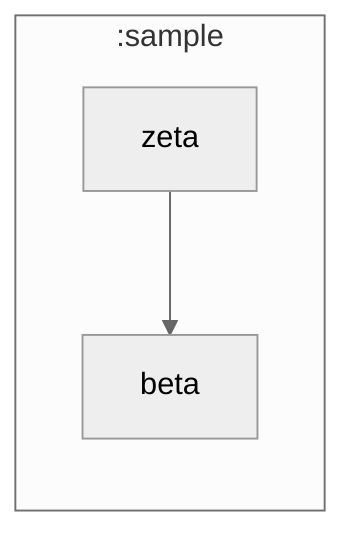

Some sample content...

# Graph

```mermaid
%%{
  init: {
    'theme': 'neutral'
  }
}%%

graph LR
  subgraph :sample
    :sample:zeta["zeta"]
    :sample:beta["beta"]
  end
  :sample:zeta --> :sample:beta
```